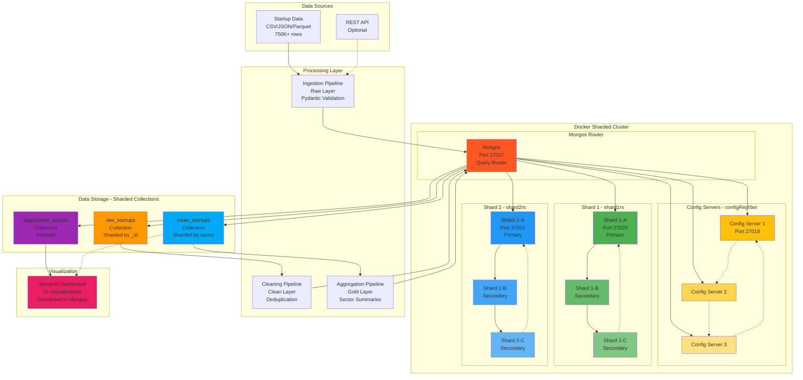

# Architecture Diagram

## System Architecture



## Data Flow

1. **Raw Layer**: Ingest startup data (750K+ rows, 8+ columns) into `raw_startups` collection
2. **Clean Layer**: Clean, normalize, deduplicate, validate with Pydantic → `clean_startups` collection
3. **Aggregated Layer**: Aggregate by sector, calculate metrics → `aggregated_sectors` collection
4. **Visualization**: Streamlit dashboard queries mongos → reads from sharded collections

## MongoDB Sharded Cluster

### **Mongos Router** (Query Router)
- **Port**: 27017 (main entry point for all clients)
- **Role**: Routes queries to appropriate shards based on shard key
- **Connection**: `mongodb://localhost:27017`

### **Config Servers** (configReplSet - 3-node replica set)
- **config1**: Port 27019 (exposed)
- **config2**: Internal
- **config3**: Internal
- **Role**: Store cluster metadata, shard mappings, chunk ranges

### **Shard 1** (shard1rs - 3-node replica set)
- **shard1-a**: Port 27020 (Primary, exposed)
- **shard1-b**: Secondary
- **shard1-c**: Secondary
- **Role**: Stores subset of data based on shard key

### **Shard 2** (shard2rs - 3-node replica set)
- **shard2-a**: Port 27021 (Primary, exposed)
- **shard2-b**: Secondary
- **shard2-c**: Secondary
- **Role**: Stores subset of data based on shard key

## Sharding Strategy

### Collections and Shard Keys

1. **`raw_startups`**
   - **Shard Key**: `{ _id: "hashed" }`
   - **Reason**: Even distribution for large volume writes during ingestion

2. **`clean_startups`**
   - **Shard Key**: `{ sector: 1, _id: 1 }`
   - **Reason**: Co-locate data by sector for efficient aggregation queries

3. **`aggregated_sectors`**
   - **Not Sharded** (small collection ~20 documents)
   - **Indexes**: sector (unique), total_startups, growth_rate, risk_score

## Technology Stack

- **Big Data Platform**: MongoDB Sharded Cluster (10 containers)
- **Processing**: Python + Pandas
- **Validation**: Pydantic models with schema enforcement
- **Type Checking**: MyPy (strict mode)
- **Testing**: PyTest with coverage
- **Visualization**: Streamlit + Matplotlib + Seaborn
- **Containerization**: Docker Compose
- **Project Management**: UV (Python package manager)

## Cluster Benefits

### High Availability
- Each shard is a 3-node replica set
- Automatic failover if primary fails
- Config servers replicated for metadata safety

### Horizontal Scalability
- Data distributed across 2 shards
- Can add more shards as data grows
- Linear performance scaling

### Performance
- Parallel query execution across shards
- Writes distributed for higher throughput
- Indexes on each shard for fast lookups

## Indexes

### Query Performance Indexes
- `clean_startups.sector` (for aggregation)
- `clean_startups.founded_year` (for time-series analysis)
- `aggregated_sectors.sector` (unique)
- `aggregated_sectors.total_startups`
- `aggregated_sectors.growth_rate`
- `aggregated_sectors.risk_score`

## Data Volume

- **Target**: 750,000+ rows
- **Columns**: 8+ meaningful columns
- **Format**: CSV/JSON/Parquet
- **Distribution**: Split across 2 shards based on shard keys

## Connection Information

### Application Connection (Python/Dashboard)
```python
from pymongo import MongoClient
client = MongoClient('mongodb://localhost:27017')
db = client['startup_analytics']
```

### Direct Shard Access (for debugging)
- Shard 1: `mongodb://localhost:27020`
- Shard 2: `mongodb://localhost:27021`
- Config: `mongodb://localhost:27019`

**Note**: Always connect to mongos (27017) for production queries!
