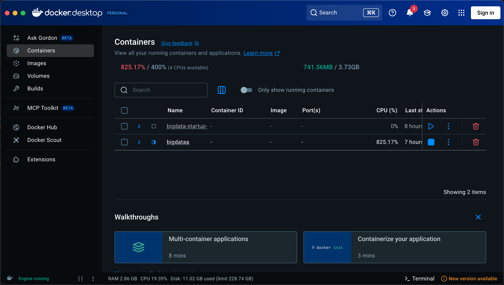

# Startup Market Analyzer 
# Project Group 12
Members: Akash, Anveshna

Hey! This is our big data capstone project where we built a distributed system to analyze startup data and help people make smarter business decisions.

## What Does This Do?

Ever wondered which startup sectors are actually worth getting into? Or if your startup idea has a good chance of success based on historical data? That's exactly what this project does.

We analyzed over **1 million startup records** to identify patterns in how different business sectors perform over time. The system has two main features:

1. **Find Your Startup Idea** - Discover high-potential sectors based on your budget, risk appetite, and goals
2. **Evaluate Your Idea** - Check how your startup concept stacks up against historical market data

Think of it as having a data analyst in your pocket who's studied a million startups and can tell you what works and what doesn't.

### Dashboard Preview

<p align="center">
  
  <br/>
  <em>Discover high-potential startup opportunities with smart filtering</em>
</p>

<p align="center">
  
  <br/>
  <em>Evaluate your startup idea against real market data</em>
</p>

## The Tech Behind It

We built this using a **MongoDB Sharded Cluster** - basically a distributed database that can handle massive amounts of data by splitting it across multiple servers. Here's what's running:

- **10 Docker containers** working together as one big database
- **1 Mongos Router** - the "front desk" that routes your queries
- **3 Config Servers** - keep track of where all the data is
- **2 Shards** (with 3 replicas each) - the actual data storage, split for scalability

**Why this architecture?** Because when you're dealing with a million+ rows of data, a single database server just won't cut it. This setup can scale horizontally (add more servers) and keeps your data safe with redundancy.

### Tech Stack

- **Database**: MongoDB Sharded Cluster (10-node distributed system)
- **Backend**: Python + Pandas for data processing
- **Data Validation**: Pydantic (ensures data quality)
- **Testing**: PyTest (because bugs are not fun)
- **Dashboard**: Streamlit (modern web UI, zero JavaScript needed!)
- **Deployment**: Docker Compose (one command to rule them all)
- **Package Manager**: UV (faster than pip, trust me)

Want to see the full architecture? Check out [ARCHITECTURE.md](ARCHITECTURE.md) for the detailed diagram.

## Project Structure

```
MarketMind/
├── src/
│   ├── __init__.py
│   ├── models/          # Pydantic models
│   ├── pipeline/        # Data processing pipelines
│   ├── database/        # MongoDB operations
│   └── utils/           # Utility functions
├── tests/               # PyTest tests
├── data/                # Data directory
│   ├── raw/            # Raw ingested data
│   ├── processed/      # Cleaned data
│   └── aggregated/     # Aggregated data
├── dashboard/           # Streamlit dashboard
├── docker-compose.yml   # MongoDB cluster setup
├── pyproject.toml       # UV project configuration
└── README.md
```

## Getting Started (Run This After Cloning!)

### Step 1: Prerequisites

You'll need these installed:
- **Docker Desktop** (or Docker + Docker Compose)
- **Python 3.10+** 
- **UV package manager** (


#  install uv


### Step 2: Clone and Setup

```bash
# 1. Clone the repo
git clone https://github.com/anveshnaaa/MarketMind.git
cd MarketMind

# 2. Install Python dependencies (UV does this fast!)
uv sync

# 3. Start the MongoDB cluster (10 containers)
docker-compose up -d

```

### Step 3: Verify Everything Works

```bash
# Check all containers are running
docker-compose ps

# Verify you're connected to the sharded cluster
docker exec mongos mongosh --eval "db.hello().msg"
# You should see: "isdbgrid" ✅
```

### Step 4: Load the Data

```bash
# Ingest 1 million startup records (takes ~2-3 minutes)
uv run python -m src.pipeline.ingest

# Clean and validate the data
uv run python -m src.pipeline.clean

# Create aggregated metrics
uv run python -m src.pipeline.aggregate
```

### Step 5: See It In Action!

```bash
# Launch the dashboard
uv run streamlit run dashboard/app.py

# Open your browser to: http://localhost:8501

```

**That's it!** You now have a fully functional distributed big data system running locally.

## What Each Component Does

### The Data Pipeline

Think of this as a 3-stage cleaning process:

**Stage 1: Raw Ingestion** 
```bash
uv run python -m src.pipeline.ingest
```
Loads 1 million startup records into MongoDB. The data gets automatically distributed across 2 shards for performance.

**Stage 2: Cleaning** 
```bash
uv run python -m src.pipeline.clean
```
Cleans up messy data - fixes missing values, standardizes formats, removes duplicates. Also validates everything using Pydantic schemas (because garbage in = garbage out).

**Stage 3: Aggregation** 
```bash
uv run python -m src.pipeline.aggregate
```
Crunches the numbers to create sector-level insights like growth rates, risk scores, and funding patterns.

### The Dashboard

```bash
uv run streamlit run dashboard/app.py
```

This launches a beautiful web interface where you can:
- **Discover opportunities** - Find the best startup sectors based on your preferences
- **Evaluate ideas** - Score your startup concept against real market data
- **Explore data** - Interactive charts and tables powered by the sharded cluster

### Running Everything at Once


```bash
# Option 1: Using the Makefile
make setup      # Install dependencies
make start      # Start Docker cluster  
make pipeline   # Run all 3 stages
make dashboard  # Launch dashboard

# Option 2: Shell script
bash scripts/run_pipeline.sh
```

## Testing & Quality Checks


```bash
# Run all tests with coverage report
uv run pytest

# Check types (because Python's dynamic typing can bite you)
uv run mypy src

# Verify data loaded correctly
uv run python scripts/verify_data.py

# See example queries and their performance
uv run python scripts/query_examples.py
```

## How Data Flows Through The System

Here's the journey of a single startup record:

```
 Raw CSV/JSON Data
    ↓
Ingestion Pipeline → MongoDB [raw_startups] (1M rows, sharded)
    ↓
Cleaning Pipeline → MongoDB [clean_startups] (validated, sharded by sector)
    ↓
Aggregation Pipeline → MongoDB [aggregated_sectors] (~20 sector summaries)
    ↓
Streamlit Dashboard → Beautiful interactive visualizations
```

The sharding means queries are split across multiple database nodes for speed. When you search for "Fintech" startups, both shards work in parallel!

## Database Collections Explained

I've got 3 main collections in MongoDB:

###  `raw_startups` (1M+ rows)
The original data, no questions asked. Sharded using **hashed `_id`** so writes are evenly distributed across servers.

###  `clean_startups` (1M+ rows) 
The cleaned, validated, production-ready data. Sharded using **`{ sector, _id }`** which is smart because:
- All "Fintech" startups live on the same shard
- Sector-based queries are lightning fast
- We avoid cross-shard queries whenever possible

### 📈 `aggregated_sectors` (~20 rows)
The high-level sector summaries. Not sharded (it's tiny!) but heavily indexed for dashboard queries.

## Performance Optimizations

**Sharding Strategy:**
- Used hashed shard keys for even data distribution
- Used compound keys for query co-location (keeps related data together)

**Indexes Created:**
- `sector` - for filtering by industry
- `founded_year` - for time-based analysis  
- `growth_rate`, `risk_score` - for ranking and sorting
- All indexes support covered queries (query can be answered from index alone)

## Project Structure

```
MarketMind/
├── src/
│   ├── models/          # Pydantic schemas
│   ├── pipeline/        # Data processing (ingest, clean, aggregate)
│   ├── database/        # MongoDB connection & operations
│   └── utils/           # Config, logging, helpers
├── tests/               # PyTest test suite
├── dashboard/           # Streamlit web app
├── scripts/             # Utility scripts
├── docker-compose.yml   # MongoDB cluster definition
└── pyproject.toml       # Python dependencies (managed by UV)
```


Built with ☕ and late nights by Anveshna

